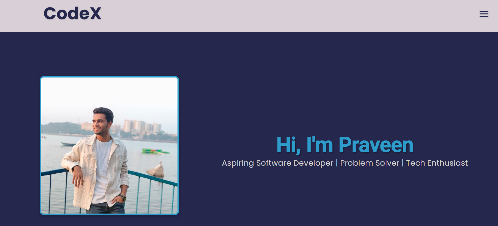
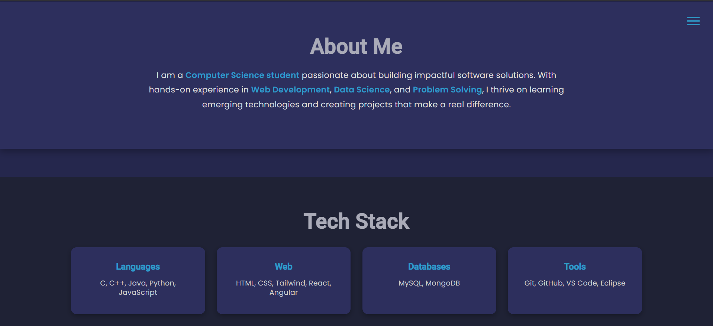
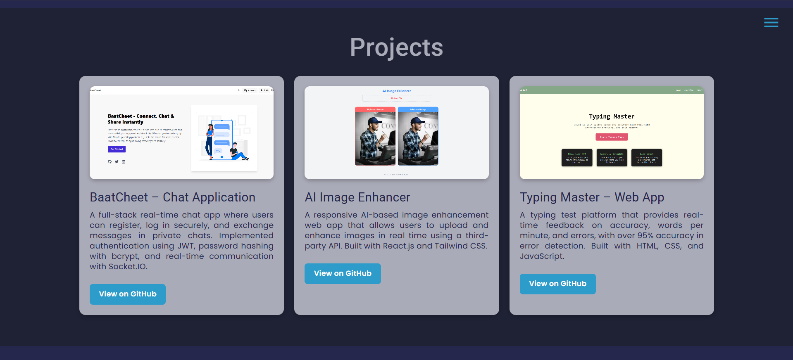
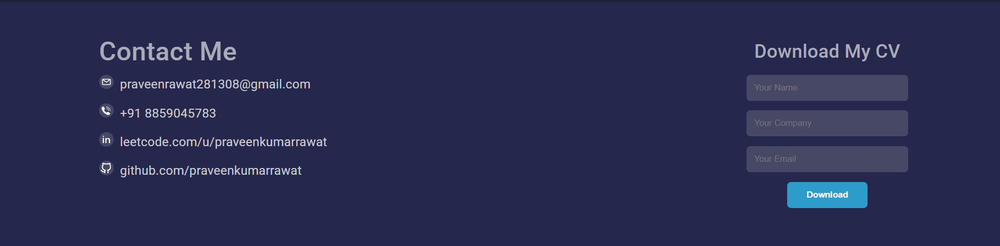

# Portfolio Website 🌐

This is my personal portfolio project built with **Angular**, showcasing my skills, projects, and resume.  
It includes a dashboard to manage visitor data and a modern responsive UI.

---

## 🖼️ Screenshots

### 1. Home Page  


### 2. About Section  


### 3. Projects Section  


### 4. Contact / Resume Download  


---

## 🛠️ Tech Stack
- **Angular**
- **TypeScript**
- **CSS / SCSS**
- **Node.js + Express (backend APIs)**
- **MongoDB (visitor tracking)**

---

## ⚡ How to Run
Clone the repo and install dependencies:
```bash
git clone https://github.com/praveenkumarrawat/Portfolio.git
cd Portfolio
npm install
ng serve
